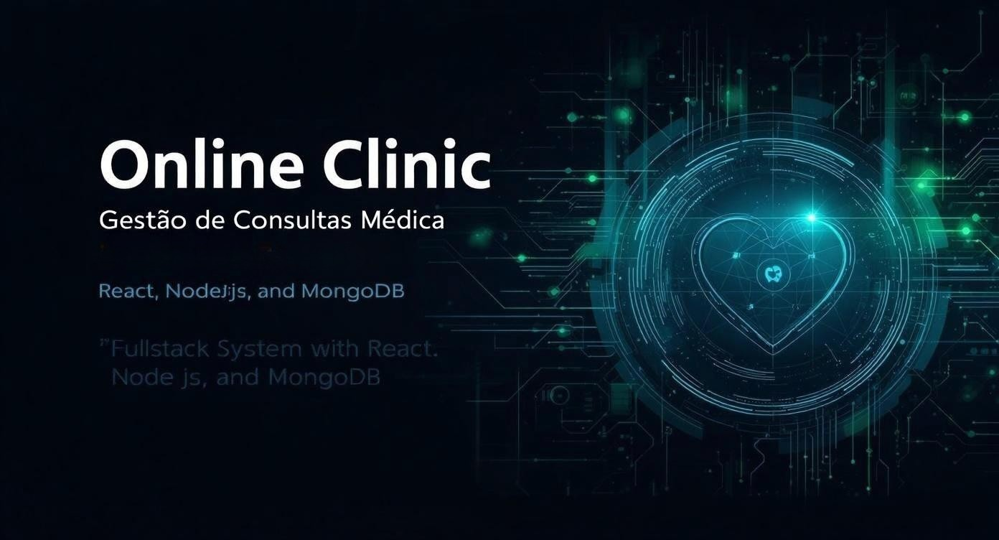

<p align="center">
  
</p>

# 🏥 Clínica Online — Sistema Completo de Gestão de Consultas e Agendamentos


Um sistema Fullstack robusto de ponta a ponta desenvolvido para automatizar e otimizar fluxos operacionais de clínicas médicas, laboratórios e postos de coleta. A aplicação une uma interface moderna e dinâmica em React à eficiência de uma API RESTful em Node.js, utilizando o MongoDB Atlas para persistência segura de dados.

---

## 🎯 Contexto Hospitalar e Regras de Negócio (O Diferencial de Saúde)
Durante minha trajetória de 7 anos atuando na linha de frente de laboratórios diagnósticos e salas de vacinas, presenciei como falhas na centralização de agendas e falta de validações de dados geram gargalos e atrasos operacionais. 

Este ecossistema foi projetado para mitigar esses problemas reais do setor de saúde:
- **Agendamento Concorrente Inteligente:** Lógica backend mapeada para mitigar duplicidade ou conflito de horários para um mesmo profissional de saúde na grade clínica.
- **Histórico Centralizado de Consultas:** Persistência no MongoDB estruturada para garantir a continuidade das informações do ciclo do paciente, simulando um Prontuário Eletrônico do Paciente (PEP).
- **Interface Otimizada para Recepção:** Telas fluidas e responsivas projetadas para diminuir o tempo de atendimento e triagem nas secretarias hospitalares e postos de coleta.

---

## 📑 Sumário
1. 🎯 Contexto Hospitalar e Regras de Negócio
2. ⚙️ Tecnologias Utilizadas
3. 📁 Estrutura do Projeto
4. 🔐 Funcionalidades Principais
5. 🚀 Implantações (Deploy)
6. 🧪 Testes da API (Thunder Client / Postman)
7. 🧭 Como Executar Localmente
8. 🧠 Próximas Funcionalidades
9. 👩‍💻 Desenvolvido por

---

## ⚙️ Tecnologias Utilizadas

### 💻 Frontend ( `/frontend` )
- **React + Vite** – Arquitetura SPA ágil e componentizada
- **TailwindCSS** – Estilização utilitária totalmente responsiva
- **Chart.js** – Renderização dinâmica de indicadores de saúde
- **LocalStorage** – Gerenciamento do ciclo de vida seguro do token JWT
- **Fetch API** – Consumo fluido dos endpoints do servidor backend

### 🧠 Backend ( `/backend` )
- **Node.js + Express** – Servidor backend modular e escalável
- **MongoDB Atlas** – Banco de dados NoSQL ideal para históricos clínicos flexíveis
- **Mongoose** – ODM para modelagem e consistência de esquemas de dados
- **JWT (Json Web Token)** – Autenticação e proteção rigorosa de rotas privadas
- **bcrypt.js** – Criptografia para segurança de credenciais médicas

---

## 📁 Estrutura do Projeto
```text
clinica-online/
├── frontend/         → Interface React (Painel Clínico)
│   ├── src/
│   ├── public/
│   ├── package.json
│   └── vite.config.js
│
├── backend/          → API RESTful (Pacientes e Consultas)
│   ├── src/
│   │   ├── models/       → Modelos e Esquemas Mongoose
│   │   ├── routes/       → Definição de endpoints protegidos
│   │   └── controllers/  → Controladores e regras de negócio
│   ├── package.json
│   └── .env
│
└── README.md
```

---

## 🔐 Funcionalidades Principais
- [x] **Autenticação Segura:** Login clínico restrito com token JWT.
- [x] **Gestão de Registros:** Cadastro unificado e listagem dinâmica de pacientes.
- [x] **Agendamento Ágil:** Ciclo básico de agendamento e cancelamento de consultas.
- [x] **Telemetria Visual:** Painel interativo com gráficos de monitoramento clínico (Chart.js).
- [x] **Ergonomia Visual:** Modo Claro e Escuro para o conforto visual em plantões.
- [x] **Ambiente em Nuvem:** Deploy completo realizado de ponta a ponta.

---

## 🚀 Implantações (Deploy)
- **Interface Web (Vercel):** 🔗 [https://vercel.app](https://vercel.app)
- **API Backend (Render):** 🔗 [https://api-pacientes-vh6j.onrender.com](https://api-pacientes-vh6j.onrender.com)

---

## 🧪 Testes da API (Thunder Client / Postman)

**➕ Criar Novo Paciente (POST)**
`POST https://api-pacientes-vh6j.onrender.com/api/pacientes`
*Corpo em formato JSON:*
```json
{
  "nome": "Ana Souza",
  "idade": 30,
  "peso": 65,
  "altura": 1.68,
  "pressao": "120/80",
  "glicemia": 95
}
```

**📋 Listar Pacientes Triados (GET)**
`GET https://api-pacientes-vh6j.onrender.com/api/pacientes`

**🔐 Autenticação de Usuário (POST)**
`POST https://api-pacientes-vh6j.onrender.com/api/auth/login`
*Credenciais de teste:*
- **E-mail:** `kelly@email.com`
- **Senha:** `001010`

---

## 🧭 Como Executar Localmente

**1. Clone o repositório e acesse o diretório:**
```bash
git clone https://github.com/KC-Neves/clinica-online.git
cd clinica-online
```

**2. Instale as dependências de cada ecossistema:**
```bash
cd backend && npm install
cd ../frontend && npm install
```

**3. Configure as variáveis de ambiente:**
Crie um arquivo `.env` na raiz da pasta `backend` com as chaves:
```env
PORT=5000
MONGO_URI=sua_string_de_conexao_mongodb
JWT_SECRET=minha_chave_supersegura
```

**4. Inicie o servidor backend:**
```bash
cd backend && npm run dev
```

**5. Inicie a interface frontend:**
```bash
cd ../frontend && npm run dev
```
Acesse no seu navegador em: 👉 `http://localhost:5173`

---

## 🧠 Próximas Funcionalidades
- [ ] **Módulo Médico:** Cadastro, login e fluxos de agendas segmentados por profissional.
- [ ] **Notificações Automatizadas:** Alertas e lembretes de exames e consultas pendentes.
- [ ] **Histórico Temporal:** Painel de evolução clínica de consultas por períodos personalizados.

---

## 👩‍💻 Desenvolvido por
**Kelly Cristina Neves Silva**
- 💼 LinkedIn / GitHub: [@KC-Neves](https://github.com/KC-Neves)
- 🌐 Projeto Integrado: HealthTech & MedTech Solutions
